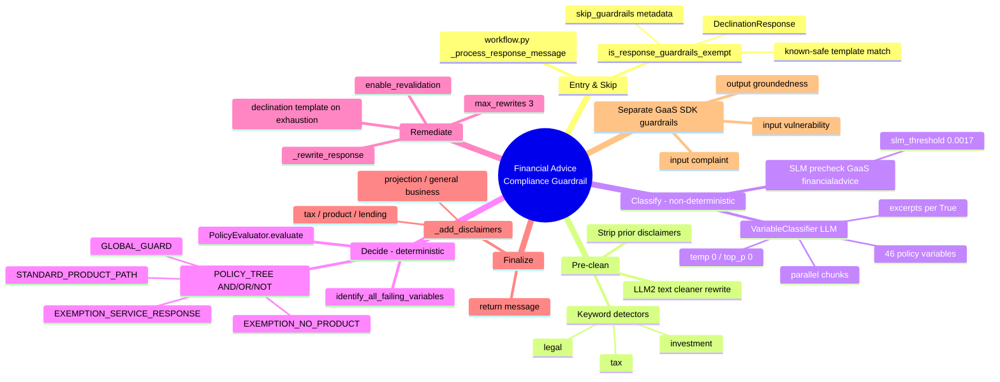
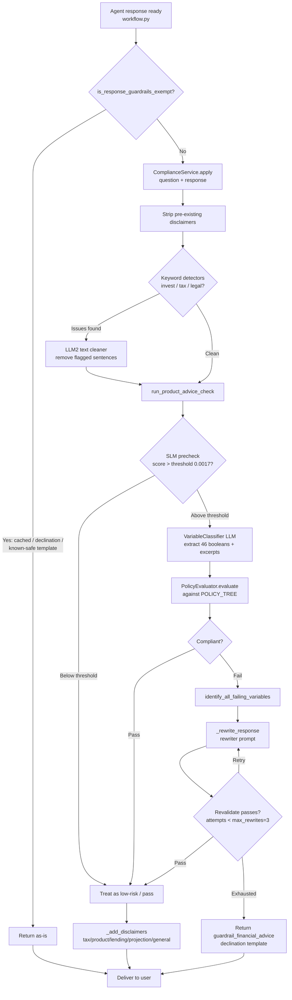

# Financial Advice Compliance Guardrail — Workflow

> **What it is:** A *hybrid (neuro-symbolic)* guardrail. An LLM/SLM **classifies** the
> `(user question, agent response)` pair into fixed boolean signals; a **deterministic
> rule engine** then decides *compliant* vs *non-compliant* (RG244 / RG255).
>
> **Golden rule:** the LLM never decides pass/fail — it only emits structured facts.
> The verdict is computed by the `POLICY_TREE`.

---

## 🧠 Mind Map

---

## 🔄 Pipeline Flowchart

---

## 📋 Steps & Roles

| # | Step | Where (file) | Role / What it does | Deterministic? |
|---|------|--------------|---------------------|----------------|
| 1 | **Entry** | `app/workflow.py` `_process_response_message()` | Called on every produced agent response before delivery. | ✅ |
| 2 | **Exemption check** | `app/utils/guardrails_utils.py` `is_response_guardrails_exempt()` | Skip the whole guardrail for cached (`skip_guardrails`), already-declined (`DeclinationResponse`), or known-safe template messages. | ✅ |
| 3 | **Apply compliance** | `app/services/compliance_service.py` `apply(message, user_input)` | Per-message entry point; passes the **(question, response)** pair down. | — |
| 4 | **Strip disclaimers** | `app/sub_agents/compliance/_disclaimers.py` | Remove disclaimers carried over from conversation history so they aren't double-counted. | ✅ |
| 5 | **Keyword detectors** | `app/sub_agents/compliance/_detectors.py` | Fast string scan for **investment / tax / legal** signals (with business-reinvestment exclusions). | ✅ |
| 6 | **Text cleaner (LLM2)** | `_prompt_builders.py` + rewriter prompt | If keyword issues found, an LLM removes the flagged sentences before deeper analysis. | ❌ (LLM) |
| 7 | **SLM precheck** | `app/guardrails/financial_advice/gaas_slm/precheck.py` | GaaS `financialadvice` small-model score vs `slm_threshold: 0.0017`. Below → fast pass; above → escalate. | ⚠️ Probabilistic |
| 8 | **Variable classification** | `core/variable_classifier.py` + `prompts/compliance_variable_classifier_chunk.prompty` | LLM classifies the **46 policy variables** True/False (+ verbatim excerpts) over the pair. `temp 0`, parallel chunks. | ❌ (LLM) |
| 9 | **Policy evaluation** | `core/policy_evaluator.py` + `policy_tree.py` | Deterministic AND/OR/NOT tree over the facts → **compliant / non-compliant**. | ✅ **(the rule engine)** |
| 10 | **Failure diagnosis** | `policy_evaluator.py` `identify_all_failing_variables()` | Traverses the tree to list *which* named signals caused failure (with excerpts). | ✅ |
| 11 | **Rewrite loop** | `output_check.py` `_rewrite_response()` + `compliance_financial_advice_rewriter.prompty` | Rewrites to fix flagged issues, re-validates; up to `max_rewrites: 3` (`enable_revalidation`). | ❌ (LLM) |
| 12 | **Declination fallback** | `guardrail_financial_advice` template | If rewrites exhausted, replace with a safe declination message. | ✅ |
| 13 | **Inject disclaimers** | `_disclaimers.py` + `app/models/disclaimers.py` | Append deterministic disclaimers: **tax, product, lending, projection, general business**. | ✅ |
| 14 | **Deliver** | `app/agent.py` | Final message returned across the A2A boundary. | — |

---

## 🛡️ Separate GaaS SDK Guardrails (different concern)

Configured in `config/system.yaml` — these run via the ABK SDK and are **not** the financial-advice verdict:

| Side | Guardrail | Action | Handler |
|------|-----------|--------|---------|
| **Input** | `vulnerability` (v2) | `blocking_response` | `agent.py` `validate_and_verify_request_guardrails` → `_handle_vulnerability` |
| **Input** | `complaint` | `blocking_response` | request guardrails |
| **Output** | `groundedness` | `blocking_response` | `agent.py` `validate_and_verify_response_guardrails` |

---

## 🎯 Key Takeaways

- **Perception vs Decision** — LLM/SLM *perceive* signals; the **rule tree** *decides*. Only step 9 (+10,12,13) is deterministic; steps 6, 8, 11 are LLM-driven.
- **The pair matters** — the guardrail always evaluates **question + response together** (input-context variables like `question_seeks_recommendation` score the user's question).
- **Auditability by design** — every `True` carries a verbatim excerpt so a failure traces to specific words.
- **Fail-safe** — parse errors default variables to `None`; `null_ratio_threshold: 0.3` distrusts too-many-null results.
